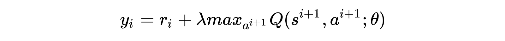
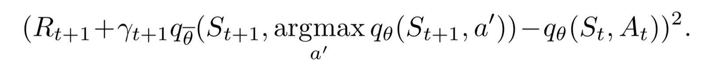

# Sonic the HedgeHog DQN
It all started when I stumbled upon the Open AI Retro Contest https://contest.openai.com/
I always liked the idea of AI playing video games and playing such an iconic platform game was too much to pass (I'm still hoping for Mario and Donkey Kong next though).

 <video src="human.mp4"/> 

That kind of challenge in complex and unpredictible environments will also contribute to agents behing useful in real life environments which evolve as you progress.

## What you need
- Installing a Deep Learning environement with Anaconda should take care of most of it.
- You will also need Open AI Gym environement along with the specific Gym Retro.
- I also added Scikit Image at some point.
- And of course the Sonic roms

## Goal
It was my first Reinforcement Learning implementation so I decided to pass on the baselines provided for the contest and start from stratch to have an intimate understanding of every step of the process of a DQN algorithm.

## Concept
Input is the observation state of the game in the form of an image capture and the score.
Output is a Q-vector estimating points earned for each possible actions given the current state.

We give the algorithm:
- the in-game score
- a bonus for advancing in the stage (delta x from max x) which is coherent with the goal of a platform game
- a malus for dying

### DQN
Given a state s and an action a the loss function will be:

  

The Q value was initially set to the estimated points earned given a state and a corresponding action but we also need to take into account the value of the state that we are left with and so, given the future discount parameter lambda, we have:

  

### Double-DQN
To stabilise the algorithm, we introduce a target network which is the same as the principal network but fixed for a set time to allow the principal alogorithm to converge without behaving like a dog chasing its own tail.

  

### Vision CNN
We use a fairly classical CNN to give our algorithm eyes, with Keras, the algorithm is quite concise:

  

Note that the activation on the output layer is linear to take into account the range of Q-values obtained on as wide a range as possible, unlike with a transformation into tanh or sigmoid.
I used a mean-squarred-error Adam optimizer.

My intuition was that you should give the algorithm more degrees of liberty to account for the complexity of the gameplay in both the last Convolutional layer (to 128) and the Dense layer (to 1024) but good luck for the convergence when you try to do that.

### Random movements
You start with random movements to gather information and you gradually decay the proportion of random movements to choose movements according to the most points you could earn in a given situation.

### Memory
The learning will take place on selected transitions in batches.
This memory will be several GB large and cannot be stored on disk for performance reasons.

### Prioritized Experience Replay
Stores transitions for training purposes.
In the vanilla version this is done randomly.
In the elaborate version, you record everything and prioritise the transitions with the highest losses.
In an ideal version, memory would be infite so that we can give neighbour-to-neighbour accurate values to each transitions taking into account the future state.

### DQN algorithm
The base algorithm then used is:

  

## Changes to the meta
### Prioritized Experience Replay at recording
We only record transitions that matters:
- with losses superior to a threshold
- when dying

### Change in observation
I didn't work with the direct observation but with the difference between current observation and the previous one. The idea was to have an image and an after image to mimic the way we see (image persistence) and also to have something like a velocity. 
That would mean:
- not having to pass several images (states) every time
- having access to velocity and its derivative, accelaration by design

### Tried a leaking AllowBackTracking
- To encourage exploration, I tried to add a range around the max x where you can earn points without a malus but I was unsuccessful

### Added "Up" action to discrete env
- "Up" may not be often useful but it sometimes is an if anything allow the algorithm t ochose to do nothing as the best option

### Resized observartions
To 128 RGB, bigger that the canon 84 BW. I think there is information in color and that 84 might be too small

### Increased batch size
Increased batch size to 256 to see more of the captured frames

## Results

 <video src="sonicR9_0.1rand.mp4"/> 

One of my many experiment. Two things to take into account:
- setting the random movements rate can prevent the algorithm to take the right movmeents at the right time: "I should jump but I am in random mode so I don't"
-  local minimium: "I should advance by default" which could be overcome by not allowing the algorithm not to earn point for a set time

I will be competing in future competition to try to overcome these limist.

## Difficulties
Tuning of the hyper-parameters with the time involved is the most difficult aspect I found in this particular challenge:
- how fast should you decay the random movements
- what should be the associated Adam learning rate
- how big should be the memory
- what is the ideal threshold for the prioritised memoy

Among other questions that I didn't have time to solve.

Overall, I think I understood the problem well enough along with the challenges involved, what did you think?

